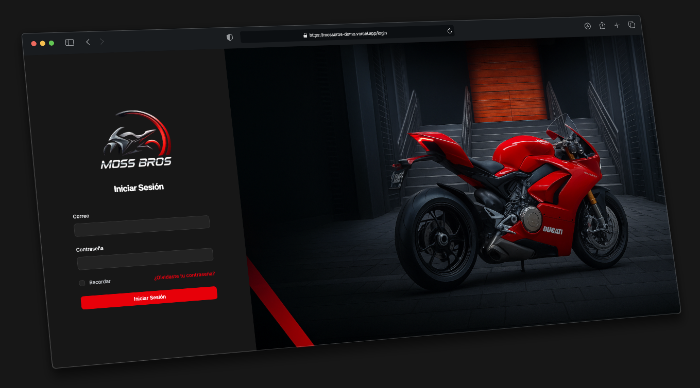
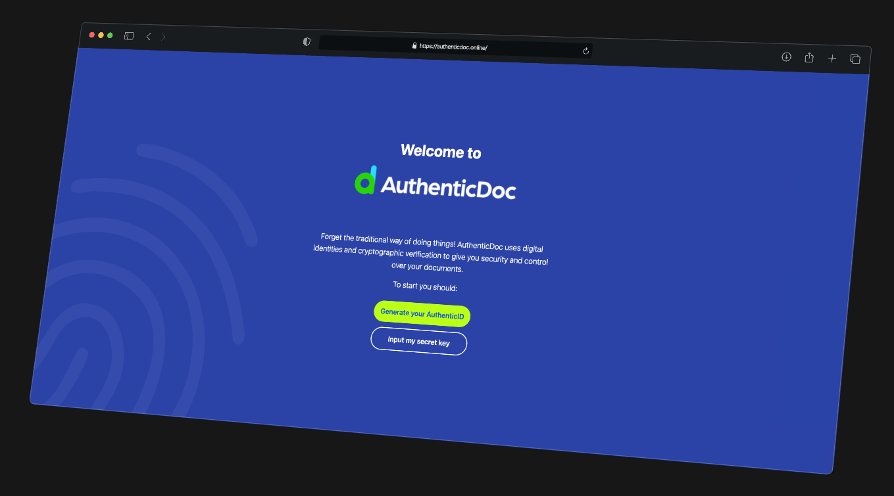
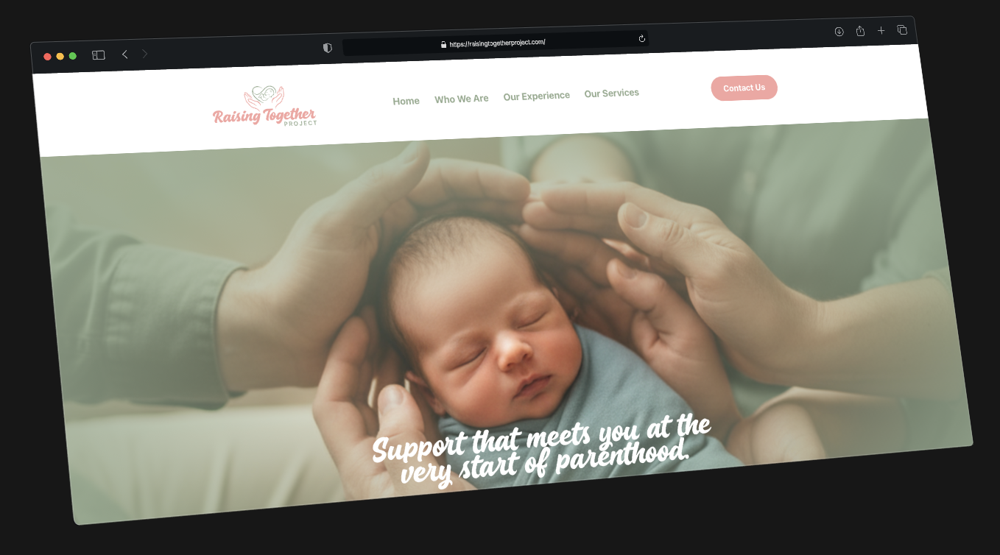

<div align="center">
  

  <h3>Your trusted technology partner</h3>
  <p><strong>From idea to users' hands in just 2 weeks</strong></p>

  [](https://nextjs.org/)
  [](https://www.typescriptlang.org/)
  [](https://tailwindcss.com/)
  [](https://react.dev/)

  [View Demo](https://quickstack.dev) • [Schedule a Call](https://cal.com/quickstack) • [Portfolio](#-featured-projects)

</div>

---

## About QuickStack

**QuickStack** is a software development agency specializing in **rapid full-stack development** for businesses that need to validate their products without losing months or budget. We don't just write code; we build the engine for your next big leap.

### Why Choose QuickStack?

- **Modern Tech Stack** — We use cutting-edge, proven technologies
- **Direct Communication** — No intermediaries, work directly with developers
- **Scalable Code** — Production-ready code you can scale tomorrow
- **Fast Delivery** — MVPs in 2-3 weeks, Landing Pages in 1 week
- **Post-Launch Support** — 30 days of included technical support

---

## Tech Stack

This landing page is built with modern, performance-focused technologies:

| Category | Technologies |
|----------|-------------|
| **Framework** | Next.js 16.1 (App Router), React 19.2 |
| **Language** | TypeScript 5 |
| **Styling** | Tailwind CSS 4, tailwindcss-animate, class-variance-authority |
| **UI Components** | Radix UI, Lucide Icons, Phosphor Icons |
| **Animations** | Framer Motion, Embla Carousel |
| **Forms** | React Hook Form, Zod validation |
| **Internationalization** | next-intl (English & Spanish) |
| **Theming** | next-themes (Dark/Light mode) |
| **Analytics** | Vercel Analytics |
| **Deployment** | Vercel Platform |

---

## Featured Projects

### MossBros - Workshop Management System


**Workshop Management** | Complete web management system for a motorcycle repair shop

- Customer and motorcycle management
- Workflow system for repairs
- Real-time metrics dashboard
- **Results:** 100% digitized • Instant search • 0 calculation errors

---

### AuthenticDoc - Decentralized Digital Signatures


**LegalTech** | Decentralized PWA using Nostr protocol

- Multi-party digital signatures
- End-to-end encryption (NIP-44)
- Lightning Network payments integration
- **Results:** 100% decentralized • 28+ languages • High-performance WASM

---

### RTP - Postpartum Doula Services


**Healthcare Services** | Professional website for postpartum doula services

- 7 services showcased
- Lead capture system
- SEO optimized
- **Results:** Professional digital presence • Instant load • Mobile-first

---

## Services

### Landing Pro
**$400 - $600 | 1 week**

Perfect for businesses that need a professional digital presence

- Responsive design (mobile-first)
- Contact form with email integration
- CRM/Database integration
- Basic SEO configured
- Deploy included

### MVP Starter
**$900 - $1,500 | 2-3 weeks** • Most Popular

Ideal for founders who need to validate with real users

- User authentication
- 3-5 core features
- Optimized database
- Basic admin panel
- Responsive design
- 1 week of adjustments included

### Custom Development
**From $1,500 | 3-6 weeks**

For projects with specific requirements

- Custom features
- External API integrations
- Scalability considered
- Testing and documentation
- Extended support

---

## Getting Started

### Prerequisites

- Node.js 20+ installed
- npm, yarn, pnpm, or bun package manager

### Installation

1. Clone the repository
```bash
git clone https://github.com/quickstack/quickstack-landing.git
cd quickstack-landing
```

2. Install dependencies
```bash
npm install
# or
yarn install
# or
pnpm install
```

3. Run the development server
```bash
npm run dev
# or
yarn dev
# or
pnpm dev
```

4. Open [http://localhost:3000](http://localhost:3000) in your browser

### Build for Production

```bash
npm run build
npm start
```

---

## Project Structure

```
quickstack-landing/
├── app/
│   ├── [locale]/          # Internationalized routes
│   │   └── page.tsx       # Main landing page
│   ├── layout.tsx         # Root layout
│   ├── globals.css        # Global styles
│   ├── robots.ts          # SEO robots configuration
│   └── sitemap.ts         # SEO sitemap generation
├── components/            # Reusable React components
├── lib/                   # Utility functions
├── messages/              # i18n translations (en, es)
│   ├── en.json
│   └── es.json
├── public/                # Static assets
│   ├── logos/             # Brand logos (dark/light variants)
│   ├── og-image.png       # Open Graph image
│   └── [screenshots]      # Project screenshots
├── middleware.ts          # Next.js middleware (i18n routing)
└── next.config.ts         # Next.js configuration
```

---

## Internationalization

This project supports **English** and **Spanish** using `next-intl`.

- **Default locale:** Spanish (`es`)
- **Supported locales:** `en`, `es`
- **Translation files:** `/messages/en.json`, `/messages/es.json`

The middleware automatically detects the user's preferred language and redirects accordingly.

---

## Development Workflow

### Code Quality

```bash
npm run lint        # Run ESLint
```

### Deployment

This project is optimized for deployment on **Vercel**:

1. Push your code to GitHub
2. Import the repository in Vercel
3. Deploy with zero configuration

[](https://vercel.com/new/clone?repository-url=https://github.com/quickstack/quickstack-landing)

---

## Performance Optimizations

- **Image Optimization:** Next.js Image component with automatic WebP conversion
- **Code Splitting:** Automatic route-based code splitting
- **Font Optimization:** Self-hosted Geist font family
- **SEO:** Configured meta tags, Open Graph, sitemap, robots.txt
- **Analytics:** Vercel Analytics integration for performance monitoring

---

## Contact

<div align="center">

### Ready to bring your vision to life?

**Book a free 30-minute strategy call**

[](https://calendly.com/quickstack-projects)
[](mailto:projects@quickstack.agency)
[](https://quickstack.agency)

</div>

---

## License

Copyright © 2026 QuickStack. All rights reserved.

This is a proprietary software project for QuickStack software agency.

---

<div align="center">
  

  <p><strong>Your trusted technology partner</strong></p>
  <p><em>We build the engine for your next big leap</em></p>
</div>
